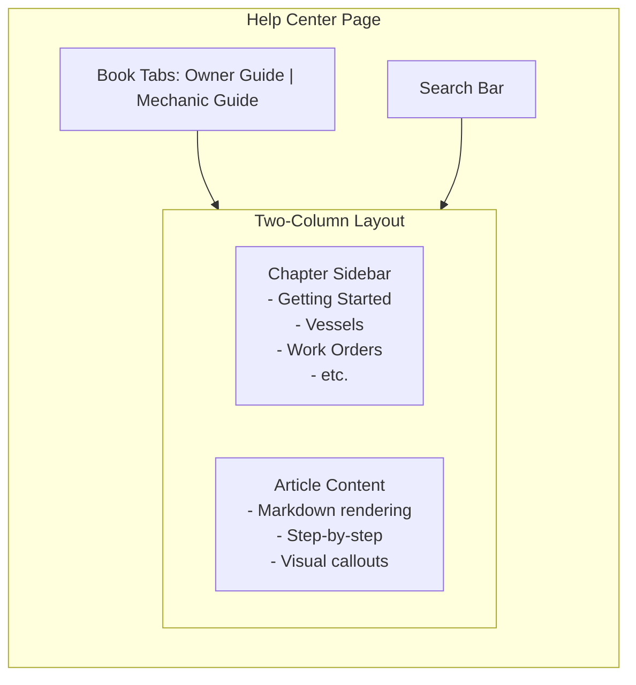

# Help & Documentation Center

## Current State

The app has a minimal help system:

- A `helpGuides` Convex table storing Markdown content with category, role filtering, and sort order ([convex/helpGuides.ts](convex/helpGuides.ts))
- A modal-based `HelpGuides` component and `HelpButton` in the header ([apps/web/components/help-guides.tsx](apps/web/components/help-guides.tsx))
- 5 seed guides total (4 owner, 1 mechanic) with basic content
- Categories: `getting_started`, `vessels`, `work_orders`, `mechanics`, `equipment`, `billing`, `troubleshooting`

## Architecture

### New Route and Component

- **New page**: `/help` route at `apps/web/app/help/page.tsx`
- **New component**: `apps/web/components/help-center.tsx` -- full-page documentation center with book-like navigation
- **Update**: `HelpButton` in header and landing page to link to `/help` instead of opening a modal
- **Keep**: Existing `helpGuides` Convex backend mostly as-is (add one optional field)

### Schema Change

Add an optional `book` field to the `helpGuides` table in `convex/schema.ts` to distinguish between owner and mechanic documentation books explicitly (beyond `targetRoles`):

```typescript
book: v.optional(v.union(v.literal("owner"), v.literal("mechanic")))
```

This allows guides that target both roles (e.g., troubleshooting) to still appear in each book with the right context.

### UI Design

The Help Center uses the existing glassmorphism design system and follows this layout:




**Features**:

- Two "book" tabs at the top: **Owner's Guide** and **Mechanic's Guide** (auto-selects based on user role)
- Left sidebar with chapters (categories) and article list
- Right content area with full Markdown rendering
- Search bar to filter across all guides in the active book
- Mobile-responsive: sidebar collapses to a dropdown
- Breadcrumb: Book > Chapter > Article
- "Next" / "Previous" article navigation at the bottom
- Progress indicators (optional)

---

## Content Structure

### Owner's Guide (Book 1)

#### Chapter 1: Getting Started (Onboarding)

1. **Welcome to QR Captain** -- Overview of the platform, what owners can do
2. **Creating Your Account** -- Sign-up flow, role selection, email/password
3. **Completing Your Owner Profile** -- Step-by-step: name, phone, address, profile photo upload and cropping
4. **Your First Vessel Setup** -- Vessel onboarding wizard: vessel info (name, make, model, year, type, registration, hull ID, photo), equipment setup (engine, batteries, electronics)
5. **Understanding the Dashboard** -- Dashboard layout, vessel grid, stats overview, quick actions
6. **Navigating the Landing Page** -- Landing page sections: stats, quick actions, announcements, service reminders, featured mechanics, activity feed

#### Chapter 2: Vessel Management

1. **Adding a New Vessel** -- Step-by-step for adding vessels from the dashboard
2. **Editing Vessel Details** -- How to update vessel info, change photo
3. **Understanding QR Codes** -- What QR codes are, how they work, sharing with mechanics
4. **Managing Your Fleet** -- Viewing all vessels, vessel count, navigating between vessels

#### Chapter 3: Equipment & Maintenance

1. **Equipment Manifest Overview** -- What the manifest is, the 15 equipment categories
2. **Adding Equipment** -- Step-by-step: name, manufacturer, model, serial number, installation date, warranty, service intervals, condition
3. **Service Intervals & Reminders** -- Date-based and hours-based tracking, overdue alerts, service reminder section on landing page
4. **Equipment Warranty Tracking** -- Warranty info, expiration tracking

#### Chapter 4: Finding & Managing Mechanics

1. **Using the Mechanic Directory** -- How to access at `/mechanics`, browsing mechanic cards
2. **Searching & Filtering** -- Filter by availability, rating, specialization, service area; sort options
3. **Viewing Mechanic Profiles** -- Mechanic spotlight: ratings, certifications, response time, reviews, contact info
4. **Adding to Your Preferred List** -- How to add mechanics, using preferred list for work orders
5. **Managing Mechanic Vessel Access** -- Granting/revoking access per vessel, viewing authorization dates
6. **Responding to Access Requests** -- Reviewing, approving, and denying mechanic access requests

#### Chapter 5: Work Orders

1. **Requesting Service** -- Step-by-step: select vessel, select mechanic, describe work, set urgency, submit
2. **Understanding Urgency Levels** -- Routine, Soon, Urgent -- when to use each
3. **Reviewing Quotes** -- Reading the quote breakdown: labor hours, rate, parts estimate, completion date, expiration
4. **Accepting or Declining Quotes** -- How to accept (starts work), decline (with reason)
5. **Tracking Work in Progress** -- Details tab: diagnosis, work performed, parts, photos, cost summary
6. **Messaging Your Mechanic** -- Chat tab: sending messages, unread indicators, real-time updates
7. **Viewing Completed Work Orders** -- Reviewing final work, parts used, total cost, photos

#### Chapter 6: Ratings & Reviews

1. **Rating a Mechanic** -- The four criteria (quality, communication, professionalism, value), overall rating, written review, 30-day window
2. **Understanding Your Owner Rating** -- How mechanics rate you (communication, preparedness, payment, respect)

#### Chapter 7: Notifications & Activity

1. **Understanding Notifications** -- All notification types, bell icon, unread count
2. **Activity Feed** -- Recent activity timeline, what events appear
3. **Announcements** -- System announcements, dismissing

#### Chapter 8: Troubleshooting

1. **Common Issues & Solutions** -- FAQ-style guide
2. **QR Code Issues** -- QR not scanning, regenerating codes
3. **Notification Problems** -- Not receiving notifications, checking settings

---

### Mechanic's Guide (Book 2)

#### Chapter 1: Getting Started (Onboarding)

1. **Welcome to QR Captain for Mechanics** -- Platform overview, what mechanics can do, how it connects you with boat owners
2. **Creating Your Account** -- Sign-up, selecting mechanic role
3. **Setting Up Your Business Profile** -- Detailed step-by-step for the 4-step onboarding wizard:
  - Step 1: Business info (years, license, address)
  - Step 2: Services & coverage (service areas, service types)
  - Step 3: Hours of operation (per-day schedule)
  - Step 4: Extras (certifications, specializations, insurance, mobile, languages, bio, website, Google My Business)
4. **Completing Your Profile Photo & Logo** -- Uploading profile photo and company logo with image cropping
5. **Understanding Your Dashboard** -- Dashboard layout: stats, authorized vessels, work orders by status, QR scanner
6. **Understanding the Landing Page** -- Stats cards, quick actions, activity feed

#### Chapter 2: Availability & Profile

1. **Managing Your Availability Status** -- Four statuses (Available, Limited, At Capacity, Unavailable), auto-suggestions, manual override
2. **Setting Max Concurrent Jobs** -- Configuring the slider (1-20), how it affects availability suggestions
3. **Updating Your Profile** -- Section-based editing, profile completion percentage
4. **Your Public Profile (Mechanic Spotlight)** -- What owners see: ratings, certifications, response time, reviews

#### Chapter 3: Vessel Access

1. **Scanning QR Codes** -- How to use the QR scanner, web and mobile, manual entry fallback
2. **Requesting Vessel Access** -- Access states: No Access, Pending, Denied, Authorized; sending request messages
3. **Your Authorized Vessels** -- Viewing the grid, vessel details, owner contact info
4. **Viewing Equipment Manifests** -- Navigating equipment categories, viewing item details
5. **Viewing Service History** -- Accessing past work orders for a vessel

#### Chapter 4: Work Orders

1. **Responding to Work Order Requests** -- Viewing pending requests, understanding urgency badges
2. **Submitting a Quote** -- Step-by-step: labor hours, rate, parts estimate, completion date, validity period, notes
3. **Declining a Request** -- How to decline, providing a reason
4. **Creating a Direct Work Order** -- Starting work on an authorized vessel without a quote request
5. **Updating Work Orders** -- The Details tab: diagnosis, work performed, labor hours/rate, autosave
6. **Adding Parts** -- Parts tab: name, part number, manufacturer, category, cost, warranty, photos; parts catalog integration
7. **Adding Work Photos** -- Photos tab: before/during/after types, captions, uploading
8. **Completing a Work Order** -- Requirements (work performed description), final cost summary
9. **Cancelling a Work Order** -- When and how to cancel

#### Chapter 5: Communication

1. **Work Order Messaging** -- Chat tab in work order editor, real-time messaging, unread counts
2. **Access Request Messages** -- Communicating with owners during access requests

#### Chapter 6: Ratings & Reviews

1. **Rating an Owner** -- Four criteria (communication, preparedness, payment, respect), review, 30-day window
2. **Understanding Your Mechanic Rating** -- Wrench rating system, how ratings affect your directory listing, featured mechanics algorithm

#### Chapter 7: Notifications & Activity

1. **Understanding Notifications** -- All mechanic notification types
2. **Activity Feed & Stats** -- Monthly stats, total jobs, average rating

#### Chapter 8: Troubleshooting

1. **Common Issues & Solutions** -- FAQ for mechanics
2. **QR Scanner Problems** -- Camera permissions, fallback manual entry
3. **Profile Not Showing in Directory** -- Incomplete profile, onboarding requirements

---

## Implementation Details

### Files to Create

- `apps/web/app/help/page.tsx` -- New Help page route
- `apps/web/components/help-center.tsx` -- Main Help Center component

### Files to Modify

- `convex/schema.ts` -- Add optional `book` field to `helpGuides` table
- `convex/helpGuides.ts` -- Add `book` field to seed data, update queries to filter by book, add search query
- `apps/web/components/help-guides.tsx` -- Update `HelpButton` to navigate to `/help` page, keep `HelpGuides` component for landing page preview (link to full help center)
- `apps/web/components/landing-page.tsx` -- Update help section to include "View All Guides" link to `/help`

### Backend Changes

1. **Schema**: Add `book` field to `helpGuides`:
  ```typescript
   book: v.optional(v.union(v.literal("owner"), v.literal("mechanic")))
  ```
2. **New query** -- `getGuidesByBook`: Fetch all guides for a specific book, grouped by category
3. **New query** -- `searchGuides`: Simple text search across title/summary/content
4. **Updated seed** -- `seedComprehensiveGuides`: Seed ~~65 guides total. Onboarding chapters (Ch 1 for both books, ~12 articles) get full step-by-step Markdown content. All other chapters (~~53 articles) get structured placeholders with correct title, summary, category, and a "This guide is coming soon" body. Real content will be written incrementally as features are finalized with the client.

### Frontend: Help Center Component

The `help-center.tsx` component structure:

- `HelpCenter` -- Main wrapper
  - `BookSelector` -- Tabs for Owner/Mechanic guide (auto-selects based on role, admin sees both)
  - `SearchBar` -- Filters guides by text match
  - `ChapterSidebar` -- Left column with category list and article titles
  - `ArticleViewer` -- Right column rendering Markdown content with proper heading styles, callout boxes, numbered steps
  - `ArticleNavigation` -- Previous/Next buttons at bottom
  - `Breadcrumbs` -- Book > Chapter > Article trail at top of content

### Content Guidelines

Each guide article follows this structure:

- **Title** (h1)
- **Overview** paragraph explaining what this guide covers
- **Prerequisites** (if applicable)
- **Step-by-step instructions** with numbered steps
- **Tips/Notes** callout boxes for important information
- **What's Next** linking to the logical next guide

Markdown content supports: headings (h1-h3), bold, italic, bullet lists, numbered lists, blockquotes (for tips/notes), and horizontal rules for section breaks.