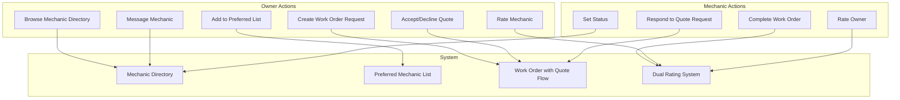
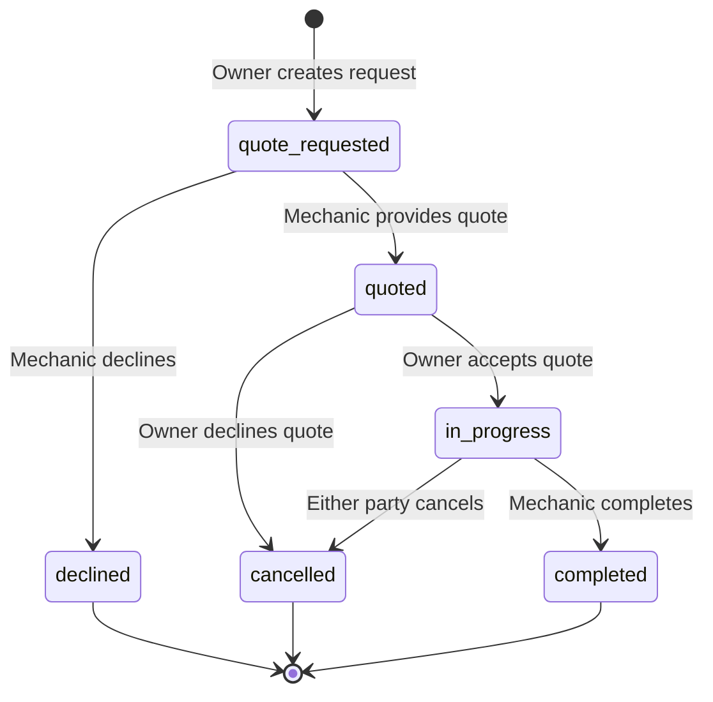

# Owner Work Order Request, Mechanic Directory, and Dual Rating System

## Architecture Overview

---

## Feature 1: Owner Work Order Request System

### Work Order Status Flow

### Schema Changes ([convex/schema.ts](convex/schema.ts))

Add to `workOrders` table:

- `status`: Expand union to include `"quote_requested" | "quoted" | "declined"`
- `requestedByOwnerId`: Optional reference to owner who requested
- `quotedLaborHours`: Optional number (mechanic's estimate)
- `quotedLaborRate`: Optional number
- `quotedPartsEstimate`: Optional number
- `quotedTotalEstimate`: Optional number
- `quoteNotes`: Optional string
- `quotedAt`: Optional timestamp
- `declineReason`: Optional string

### Backend Changes ([convex/workOrders.ts](convex/workOrders.ts))

New mutations:

- `requestWorkOrder`: Owner creates a work order request (status: "quote_requested")
- `submitQuote`: Mechanic submits quote with estimated costs
- `declineWorkOrderRequest`: Mechanic declines with optional reason
- `acceptQuote`: Owner accepts quote (transitions to "in_progress")
- `declineQuote`: Owner declines quote (transitions to "cancelled")

New queries:

- `getMyWorkOrderRequests`: Owner's pending requests
- `getPendingQuoteRequests`: Mechanic's incoming requests

### UI Components

**Owner Side:**

- Work order request form in `apps/web/components/work-order-request-form.tsx`
  - Select mechanic from preferred list
  - Select vessel and equipment
  - Describe work needed
  - Request urgency level (routine, soon, urgent)
- Quote viewer component for reviewing mechanic quotes

**Mechanic Side:**

- Quote request list in dashboard
- Quote submission form with labor/parts estimates
- Decline with reason option

---

## Feature 2: Mechanic Directory

### Schema Changes ([convex/schema.ts](convex/schema.ts))

Add to `users` table (mechanic fields):

- `availabilityStatus`: `"available" | "unavailable" | "at_capacity" | "limited"` 
- `availabilityStatusUpdatedAt`: Timestamp
- `isAvailabilityManuallySet`: Boolean (for hybrid calculation)
- `maxConcurrentJobs`: Optional number (for auto-calculation threshold)

New `mechanicMetrics` table (calculated/cached):

- `mechanicId`: Reference to user
- `avgResponseTimeMinutes`: Number (calculated from message response times)
- `totalJobsCompleted`: Number
- `updatedAt`: Timestamp

### Backend Changes

**New file:** `convex/mechanicDirectory.ts`

- `listMechanics`: Query all approved mechanics with filters (status, rating, service areas)
- `getMechanicSpotlight`: Get detailed mechanic profile with all metrics
- `updateAvailabilityStatus`: Mechanic sets their status
- `calculateSuggestedStatus`: Internal function to suggest status based on active jobs

**Update:** `convex/messages.ts`

- Add `calculateAverageResponseTime`: Calculate mechanic's avg response time
- Track response times when messages are sent/read

### Response Time Calculation Logic

Track time between:

1. Owner sends message → Mechanic first reply
2. Calculate rolling 30-day average
3. Display as: "Typically responds within X hours/minutes"

### UI Components

**New:** `apps/web/components/mechanic-directory.tsx`

- Grid/list of mechanic cards
- Search and filter controls (by service area, specialization, availability)
- Sort options (rating, response time, jobs completed)

**New:** `apps/web/components/mechanic-card.tsx`

- Company logo or profile photo (logo priority)
- Company name
- Availability status badge (color-coded)
- Wrench rating (1-5 wrenches with decimal)
- Response time indicator
- Service areas preview
- Click to open spotlight

**New:** `apps/web/components/mechanic-spotlight.tsx`

- Full profile header with logo and contact info
- Stats section: wrench rating, response time, total jobs
- Specializations and certifications
- Years in business, licenses
- Service hours display
- Service areas map/list
- Recent reviews section
- "Message" and "Add to Preferred List" buttons

**New:** `apps/web/components/general-messaging.tsx`

- Implement UI for existing general messaging backend
- Conversation list view
- Chat interface

---

## Feature 3: Preferred Mechanic List (Owner-Level)

### Schema Changes ([convex/schema.ts](convex/schema.ts))

New `preferredMechanics` table:

- `ownerId`: Reference to owner user
- `mechanicId`: Reference to mechanic user
- `addedAt`: Timestamp
- `notes`: Optional string (owner's private notes about mechanic)

### Backend Changes

**New file:** `convex/preferredMechanics.ts`

- `addToPreferredList`: Add mechanic with optional vessel authorizations
- `removeFromPreferredList`: Remove mechanic from preferred list
- `getPreferredMechanics`: Get owner's preferred mechanics with details
- `updatePreferredMechanicVessels`: Update which vessels mechanic has access to

### Integration with Vessel Authorization

When adding to preferred list:

1. Create `preferredMechanics` record
2. Create `mechanicAuthorizations` for selected vessels
3. Generate/send QR code image to mechanic via notification
4. Mechanic receives notification with owner's vessel QR codes

### UI Components

**Update:** `apps/web/components/owner-profile.tsx`

- Add "Preferred Mechanics" section
- List of preferred mechanics with vessel access toggles
- "Add from Directory" button

**New:** `apps/web/components/add-preferred-mechanic-modal.tsx`

- Mechanic selection (from directory or search)
- Vessel selection checkboxes
- Notes field

---

## Feature 4: Dual Rating System

### Schema Changes ([convex/schema.ts](convex/schema.ts))

Replace `ratings` table with more comprehensive structure:

**New `mechanicRatings` table** (owner rates mechanic):

- `workOrderId`: Reference
- `ownerId`: Reference (rater)
- `mechanicId`: Reference (rated)
- `overallRating`: Number (1-5)
- `qualityRating`: Number (1-5) - Quality of work
- `communicationRating`: Number (1-5) - Responsiveness and clarity
- `professionalismRating`: Number (1-5) - Conduct and timeliness
- `valueRating`: Number (1-5) - Fair pricing
- `review`: Optional string
- `createdAt`: Timestamp

**New `ownerRatings` table** (mechanic rates owner):

- `workOrderId`: Reference
- `mechanicId`: Reference (rater)
- `ownerId`: Reference (rated)
- `overallRating`: Number (1-5)
- `communicationRating`: Number (1-5) - Clear about needs, responsive
- `preparednessRating`: Number (1-5) - Vessel accessible, info provided
- `paymentRating`: Number (1-5) - Timely and fair payment
- `respectRating`: Number (1-5) - Professional treatment
- `review`: Optional string
- `createdAt`: Timestamp

### Rating Criteria Summary

**Owner rates Mechanic (4 criteria + overall):**

1. Quality of Work - Did they fix it right?
2. Communication - Were they responsive and clear?
3. Professionalism - On time, clean, courteous?
4. Value - Fair pricing for work performed?

**Mechanic rates Owner (4 criteria + overall):**

1. Communication - Clear about needs, responsive to questions?
2. Preparedness - Was vessel accessible, info provided?
3. Payment - Timely and fair payment?
4. Respect - Professional and courteous treatment?

### Backend Changes

**Update:** `convex/ratings.ts`

- Rename/restructure for dual system
- `createMechanicRating`: Owner submits rating
- `createOwnerRating`: Mechanic submits rating
- `getMechanicRatings`: Get all ratings for a mechanic
- `getOwnerRatings`: Get all ratings for an owner
- `getMechanicAverageRatings`: Calculate averages per criteria
- `getOwnerAverageRatings`: Calculate averages per criteria
- `canRateWorkOrder`: Check if rating is allowed (completed, not already rated)

### Rating Workflow

1. Work order marked "completed"
2. Notification sent to both parties: "Rate your experience"
3. Both can rate independently (order doesn't matter)
4. Reminder after 3 days if not rated
5. Rating window closes after 30 days

### UI Components

**New:** `apps/web/components/mechanic-rating-form.tsx`

- Wrench icons (1-5) for mechanic ratings
- 4 criteria sliders/selectors
- Overall rating auto-calculated as average (can be adjusted)
- Optional review text
- Submit button

**New:** `apps/web/components/owner-rating-form.tsx`

- Star icons (1-5) for owner ratings
- 4 criteria sliders/selectors
- Overall rating auto-calculated as average (can be adjusted)
- Optional review text
- Submit button

**New:** `apps/web/components/wrench-rating.tsx`

- Reusable wrench icon rating display for mechanics
- Supports half-wrenches for decimals
- Configurable size and color

**New:** `apps/web/components/star-rating.tsx`

- Reusable star icon rating display for owners
- Supports half-stars for decimals
- Configurable size and color

**Update:** `apps/web/components/mechanic-profile.tsx`

- Display wrench ratings with criteria breakdown
- Show recent reviews

**Update:** `apps/web/components/owner-profile.tsx`

- Display owner's star rating
- Visible to mechanics when viewing owner details

---

## Notifications

Add new notification types in `convex/notifications.ts`:

- `work_order_requested`: Mechanic receives request from owner
- `quote_submitted`: Owner receives quote
- `quote_accepted`: Mechanic notified of acceptance
- `quote_declined`: Mechanic notified of decline
- `request_declined`: Owner notified mechanic declined
- `rate_mechanic_reminder`: Prompt owner to rate
- `rate_owner_reminder`: Prompt mechanic to rate
- `added_to_preferred_list`: Mechanic added by owner (includes QR codes)

---

## File Changes Summary

**New Files:**

- `convex/mechanicDirectory.ts` - Directory queries and status management
- `convex/preferredMechanics.ts` - Preferred list management
- `apps/web/components/mechanic-directory.tsx` - Directory page
- `apps/web/components/mechanic-card.tsx` - Card component
- `apps/web/components/mechanic-spotlight.tsx` - Detail view
- `apps/web/components/work-order-request-form.tsx` - Owner request form
- `apps/web/components/quote-viewer.tsx` - Quote review UI
- `apps/web/components/rating-form.tsx` - Dual rating form
- `apps/web/components/wrench-rating.tsx` - Wrench icon component
- `apps/web/components/general-messaging.tsx` - Messaging UI
- `apps/web/components/add-preferred-mechanic-modal.tsx` - Add mechanic modal

**Modified Files:**

- `convex/schema.ts` - Schema updates for all features
- `convex/workOrders.ts` - Quote workflow mutations
- `convex/ratings.ts` - Dual rating system
- `convex/notifications.ts` - New notification types
- `convex/messages.ts` - Response time tracking
- `convex/users.ts` - Availability status, rating display
- `apps/web/components/owner-profile.tsx` - Preferred mechanics section
- `apps/web/components/mechanic-profile.tsx` - Enhanced ratings display

