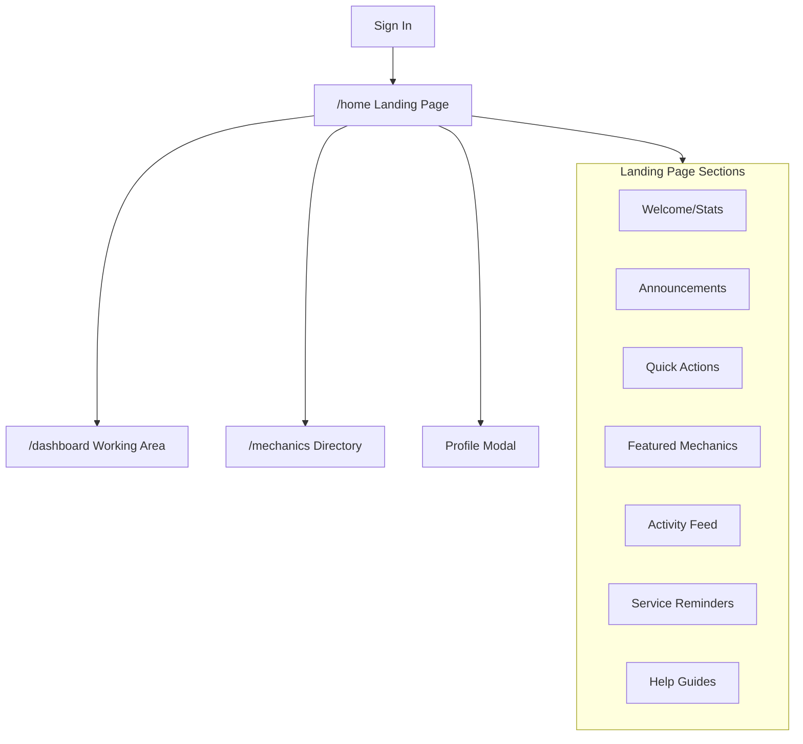
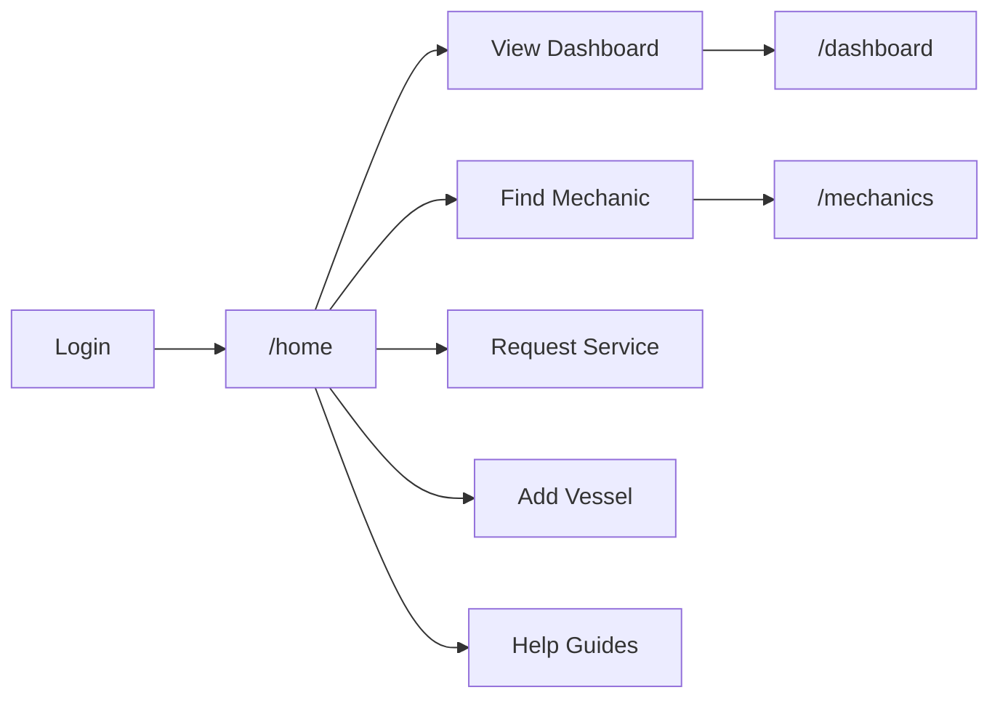

# QR Captain Landing Page

## Overview

A new `/home` route will serve as the primary landing page after login. It provides a centralized hub with role-adaptive content: announcements, help guides, quick actions, activity feeds, and featured mechanics. The existing dashboard at `/` will remain intact as the "working dashboard."

## Architecture




## File Structure Changes

**New Files:**

- `[apps/web/app/home/page.tsx](apps/web/app/home/page.tsx)` - Home page route
- `[apps/web/components/landing-page.tsx](apps/web/components/landing-page.tsx)` - Main landing component
- `[apps/web/components/announcements-feed.tsx](apps/web/components/announcements-feed.tsx)` - Announcements display
- `[apps/web/components/help-guides.tsx](apps/web/components/help-guides.tsx)` - Help/documentation section
- `[apps/web/components/activity-feed.tsx](apps/web/components/activity-feed.tsx)` - Recent activity aggregator
- `[apps/web/components/service-reminders.tsx](apps/web/components/service-reminders.tsx)` - Equipment maintenance alerts
- `[apps/web/components/featured-mechanics.tsx](apps/web/components/featured-mechanics.tsx)` - Top mechanics spotlight
- `[convex/announcements.ts](convex/announcements.ts)` - Announcements backend

**Modified Files:**

- `[convex/schema.ts](convex/schema.ts)` - Add announcements and helpGuides tables
- `[apps/web/app/page.tsx](apps/web/app/page.tsx)` - Redirect authenticated users to `/home`

---

## Schema Additions

Add to `convex/schema.ts`:

```typescript
// System announcements from admins
announcements: defineTable({
  title: v.string(),
  content: v.string(),
  type: v.union(
    v.literal("info"),          // General information
    v.literal("feature"),       // New feature announcement
    v.literal("maintenance"),   // Scheduled maintenance
    v.literal("tip"),           // Seasonal/helpful tips
    v.literal("urgent")         // Critical alerts
  ),
  targetRoles: v.array(v.union(
    v.literal("owner"),
    v.literal("mechanic"),
    v.literal("admin"),
    v.literal("all")
  )),
  isActive: v.boolean(),
  isPinned: v.boolean(),        // Show at top
  expiresAt: v.optional(v.number()),
  createdAt: v.number(),
  createdBy: v.id("users"),
})
  .index("by_active", ["isActive"])
  .index("by_type", ["type"]),

// Help guides content (admin-managed)
helpGuides: defineTable({
  title: v.string(),
  summary: v.string(),
  content: v.string(),          // Markdown content
  category: v.union(
    v.literal("getting_started"),
    v.literal("vessels"),
    v.literal("work_orders"),
    v.literal("mechanics"),
    v.literal("equipment"),
    v.literal("billing"),
    v.literal("troubleshooting")
  ),
  targetRoles: v.array(v.union(
    v.literal("owner"),
    v.literal("mechanic"),
    v.literal("admin")
  )),
  sortOrder: v.number(),
  isActive: v.boolean(),
  createdAt: v.number(),
  updatedAt: v.number(),
})
  .index("by_category", ["category"])
  .index("by_active", ["isActive"]),
```

---

## Landing Page Sections by Role

### All Roles

- **Header**: QR Captain branding, notifications, profile access
- **Announcements Feed**: System announcements filtered by role
- **Help Guides**: Contextual documentation
- **Navigation**: Clear paths to key features

### Owner-Specific (Primary Focus)

- **Welcome Stats Card**
  - Total vessels, active work orders, pending quotes
  - Quick fleet health overview
- **Quick Actions**
  - Request Service, Find Mechanic, Add Vessel, View Dashboard
- **Featured Mechanics**
  - Top-rated mechanics in owner's service areas
  - Preferred mechanics quick access
- **Service Reminders**
  - Equipment due for service (uses `nextServiceDate` from `vesselEquipment`)
  - Warranty expirations
- **Activity Feed**
  - Recent quotes received, work order updates, messages
- **Seasonal Tips** (optional enhancement)
  - Time-based content (winterization Nov-Dec, spring commissioning Mar-Apr)

### Mechanic-Specific

- **Welcome Stats Card**
  - Active jobs, jobs completed this month, current rating
  - Availability status toggle
- **Quick Actions**
  - View Work Orders, Update Availability, View Profile
- **Pending Quote Requests**
  - Work order requests awaiting response
- **Activity Feed**
  - Recent job completions, ratings received, messages

### Admin-Specific

- **System Stats Card**
  - Total users, vessels, work orders, recent signups
- **Quick Actions**
  - Manage Users, Create Announcement, System Settings
- **Announcement Management**
  - Quick create/edit announcements
- **Recent Activity**
  - New signups, work order volume, system health

---

## Missing Functionality to Implement

### High Priority

1. **Announcements System** - Admin creates announcements, users see role-filtered feed
2. **Help Guides** - In-app documentation with categories
3. **Activity Feed Aggregation** - Combine notifications, quotes, work orders into a feed
4. **Service Reminders Query** - Query equipment by `nextServiceDate` to surface due items

### Medium Priority

1. **Featured Mechanics Algorithm** - Surface top-rated mechanics based on ratings, response time, availability
2. **Seasonal Tips Content** - Admin-managed tips that display based on time of year

### Optional Enhancements

1. **Weather Widget** - Local marine weather (requires external API)
2. **Onboarding Tour** - Guided walkthrough for new users
3. **Dashboard Widgets Customization** - Let users rearrange landing page sections

---

## Navigation Flow




After login, users land on `/home`. The current dashboard will move to `/dashboard` (or `/` can redirect to `/home` for authenticated users).

---

## Key Implementation Details

### Backend: `convex/announcements.ts`

- `getActiveAnnouncements(role)` - Fetch announcements for user's role
- `createAnnouncement(...)` - Admin mutation
- `updateAnnouncement(...)` - Admin mutation
- `dismissAnnouncement(...)` - Track user dismissals

### Backend: `convex/helpGuides.ts`

- `getGuidesByRole(role, category?)` - Fetch guides for user
- `getGuide(id)` - Fetch single guide with content
- Admin CRUD mutations

### Backend: `convex/vesselEquipment.ts` (existing, add query)

- `getUpcomingServiceItems(ownerId, daysAhead)` - Equipment due for service

### Backend: `convex/mechanicDirectory.ts` (existing, add query)

- `getFeaturedMechanics(limit, serviceAreas?)` - Top mechanics by rating + availability

### Frontend: `apps/web/components/landing-page.tsx`

- Role-detection and conditional rendering
- Responsive grid layout for sections
- Card-based design matching existing UI patterns

---

## UI/UX Considerations

- **Mobile-first responsive design** using existing Tailwind patterns
- **Card-based layout** consistent with current dashboard
- **Quick actions** prominently placed above the fold
- **Announcements** with dismiss capability and color-coded by type
- **Help guides** expandable accordion or modal viewer
- **Activity feed** with infinite scroll or "Show More"
- **Service reminders** with urgency indicators (red/yellow/green)

