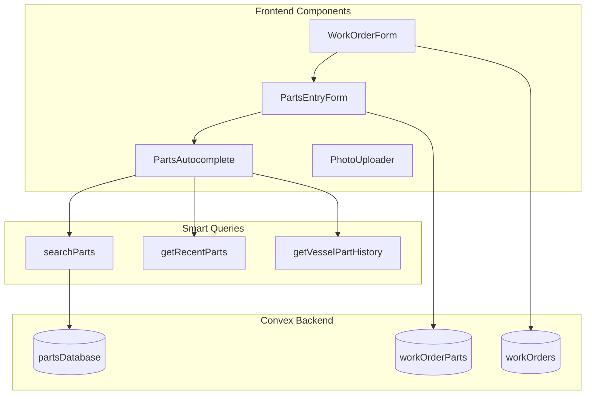
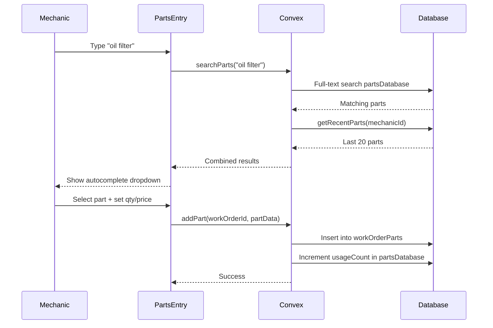

# Work Order Parts System

## Architecture Overview




## Phase 1: Database Schema

### New `partsDatabase` table ([convex/schema.ts](convex/schema.ts))

```typescript
partsDatabase: defineTable({
  partNumber: v.string(),
  name: v.string(),
  manufacturer: v.string(),
  category: v.union(
    v.literal("engine"),
    v.literal("electrical"),
    v.literal("plumbing"),
    v.literal("fuel"),
    v.literal("cooling"),
    v.literal("steering"),
    v.literal("hvac"),
    v.literal("safety"),
    v.literal("general")
  ),
  description: v.optional(v.string()),
  averagePrice: v.optional(v.number()),
  isSeeded: v.boolean(), // true for pre-populated, false for user-added
  usageCount: v.number(), // track popularity
  createdAt: v.number(),
})
  .index("by_manufacturer", ["manufacturer"])
  .index("by_category", ["category"])
  .index("by_partNumber", ["partNumber"])
  .searchIndex("search_parts", { searchField: "name", filterFields: ["manufacturer", "category"] })
```

## Phase 2: Backend Functions

### New file: [convex/parts.ts](convex/parts.ts)

**Queries:**

- `searchParts` - Full-text search with filters (manufacturer, category)
- `getRecentParts` - Last 20 parts used by this mechanic
- `getVesselPartHistory` - Parts previously used on this specific vessel
- `getManufacturers` - List of unique manufacturers for dropdown
- `getCategories` - List of part categories

**Mutations:**

- `addPartToCatalog` - Add new part to database (auto-created when mechanic enters new part)
- `incrementUsageCount` - Track part popularity

### Update: [convex/workOrders.ts](convex/workOrders.ts)

**Update `addPart` mutation:**

- Auto-add new parts to `partsDatabase` if not exists
- Track usage count
- Support photo storage ID for part photos

## Phase 3: Frontend Components

### 3.1 Work Order Creation Form

**New component:** `apps/web/components/work-order-form.tsx`

- Triggered from "Start Work Order" buttons in dashboard/authorized vessels
- Fields:
  - Description (required) - What's the issue?
  - Diagnosis (optional) - Initial assessment
  - Equipment reference (optional dropdown) - Link to vessel equipment
- Auto-sets: vesselId, mechanicId, status="in_progress", startedAt

### 3.2 Smart Parts Entry Component

**New component:** `apps/web/components/parts-entry.tsx`

```
+--------------------------------------------------+
| Add Parts                                        |
+--------------------------------------------------+
| [Search parts or enter new...]           [+ Add] |
|                                                  |
| Recently Used:                                   |
| [Mercury Oil Filter] [Yamaha Impeller] [...]     |
|                                                  |
| Previously on this vessel:                       |
| [Quicksilver Anode - used 6 months ago]          |
+--------------------------------------------------+
| Parts Added:                                     |
| +----------------------------------------------+ |
| | Mercury Oil Filter (35-877761K01)            | |
| | Qty: 1  |  $24.99  |  [photo] [x remove]     | |
| +----------------------------------------------+ |
+--------------------------------------------------+
```

**Features:**

- Autocomplete dropdown with search results
- Quick-select chips for recent parts
- Vessel history section showing past parts
- Manual entry mode for new parts
- Per-part fields: quantity, price, photo upload option

### 3.3 Parts Autocomplete Dropdown

**New component:** `apps/web/components/parts-autocomplete.tsx`

- Debounced search (300ms)
- Shows: part name, manufacturer, part number, category badge
- Keyboard navigation (arrow keys, enter to select)
- "Add as new part" option when no match found

### 3.4 Work Order Detail/Edit View

**New component:** `apps/web/components/work-order-editor.tsx`

- View/edit mode toggle
- Update diagnosis, work performed
- Add/remove parts using PartsEntry
- Upload before/during/after photos
- Labor tracking (hours, rate)
- Complete or cancel work order

## Phase 4: Seed Data

### Initial Parts (~25 common marine parts)

**File:** `convex/seedParts.ts`


| Category   | Parts                                                                              |
| ---------- | ---------------------------------------------------------------------------------- |
| Engine     | Oil Filter (Mercury, Yamaha, Volvo), Impeller (3 brands), Spark Plugs, Fuel Filter |
| Electrical | Marine Battery, Fuse Kit, Bilge Pump Switch, LED Nav Light                         |
| Cooling    | Thermostat, Water Pump, Coolant Hose                                               |
| Fuel       | Fuel/Water Separator, Fuel Line, Primer Bulb                                       |
| General    | Zinc Anode, Propeller Nut Kit, Marine Grease, Gear Oil                             |


**Seeding approach:** 

- One-time mutation `seedInitialParts` callable from dashboard (admin only)
- Or automatic seeding on first deploy via Convex init

## Phase 5: Integration Points

### Update Dashboard ([apps/web/components/dashboard.tsx](apps/web/components/dashboard.tsx))

- Replace "Start Work Order" alert with actual form
- Add "Active Work Orders" section for mechanics showing editable work orders
- Quick access to edit in-progress work orders

### Update Authorized Vessels ([apps/web/components/authorized-vessels.tsx](apps/web/components/authorized-vessels.tsx))

- "Start Work Order" button opens WorkOrderForm modal
- Show active work order indicator if one exists

## Data Flow




## Files to Create/Modify

**Create:**

- `convex/parts.ts` - Parts catalog queries/mutations
- `convex/seedParts.ts` - Initial seed data
- `apps/web/components/work-order-form.tsx` - Create work order
- `apps/web/components/work-order-editor.tsx` - Edit work order
- `apps/web/components/parts-entry.tsx` - Smart parts entry
- `apps/web/components/parts-autocomplete.tsx` - Autocomplete dropdown

**Modify:**

- `convex/schema.ts` - Add partsDatabase table
- `convex/workOrders.ts` - Update addPart to auto-catalog
- `apps/web/components/dashboard.tsx` - Wire up work order forms
- `apps/web/components/authorized-vessels.tsx` - Wire up start work order

