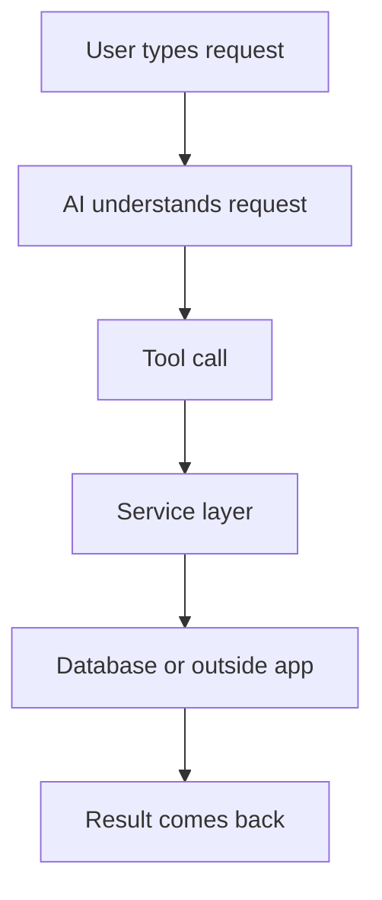
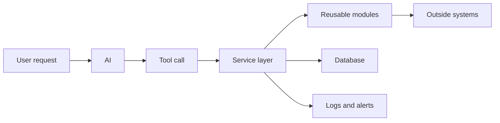

# Mike's System Ideas For Beginners

This is the simplest version of Mike's approach.

The goal of this file is to explain the technical terms inside the main breakdown without assuming a software background.

Related files:
- [mike-systems-extraction.md](/Users/tigerphoenix/Documents/LottiesLaundromat/mike-systems-extraction.md)
- [mike-systems-breakdown.md](/Users/tigerphoenix/Documents/LottiesLaundromat/mike-systems-breakdown.md)

## 1. The Big Picture

Mike is basically saying:

"Do not let AI be the whole business system. Build a real system first, then let AI be the easiest way to use it."

That system usually has a few layers:

Example:

1. A customer service rep says, "Schedule a pickup for Angela tomorrow morning."
2. AI figures out what the user wants.
3. AI calls the right tool.
4. The tool runs a real scheduling service.
5. The service saves the order and sends the confirmation.

## 2. What Is A Service Layer?

### Simple definition
A service layer is the part of the system that actually does the business work.

It is where the rules live.

### In plain English
If AI is the receptionist, the service layer is the operations team in the back office.

The receptionist talks to the customer.
The operations team actually books the job, charges the card, updates the order, and sends the text.

### What belongs in a service layer
- create customer
- create pickup order
- update order status
- generate invoice
- assign driver
- mark machine as out of service

### What should not live only in the AI prompt
- pricing rules
- scheduling rules
- refund logic
- customer eligibility rules
- employee permissions

### Laundromat example
You might have services like:
- `createWashDryFoldOrder()`
- `schedulePickupWindow()`
- `sendReadyForPickupText()`
- `recordMachineMaintenanceIssue()`

The AI should call those services.
The AI should not invent those rules each time.

## 3. What Is A Tool Call?

### Simple definition
A tool call is how the AI tells the system to do a real action.

### In plain English
The AI is not doing the job itself.
It is pressing the right button inside the system.

### Example
If a user says:
"Create a new customer for James Carter and book wash-and-fold for Friday"

The AI might call tools like:
- `create_customer`
- `create_order`
- `schedule_pickup`

Each tool points to real system logic.

### Why this matters
Without tool calls, AI mostly just talks.
With tool calls, AI can actually do work.

### Laundromat example
Possible tools:
- `find_customer`
- `create_customer`
- `create_pickup_order`
- `quote_order_price`
- `check_machine_status`
- `open_maintenance_ticket`

## 4. What Makes A Module Reusable?

### Simple definition
A reusable module is a piece of code built once so it can be used again in many projects.

### In plain English
It is a clean, packaged building block.

Instead of rebuilding the same plumbing over and over, you build it once and plug it in where needed.

### Good signs that something should be a reusable module
- many clients will need it
- it mostly handles technical setup
- it connects to the same outside provider every time
- the client-specific differences are small

### Common reusable modules
- payment module
- email module
- SMS module
- calendar module
- maps or route module
- file upload module

### Laundromat example
If you connect to Twilio for text messages, you should not rewrite texting for every project.

Build one SMS module with actions like:
- send order confirmation
- send pickup reminder
- send order complete message

Then any future app can reuse it.

## 5. What Is Observability?

### Simple definition
Observability means being able to see what your system is doing and what is going wrong.

### In plain English
It answers questions like:
- what happened?
- who did it?
- when did it break?
- where did it fail?
- how bad is it?

### Observability usually includes
- logs
- metrics
- error tracking
- alerts
- audit trails

### Very simple examples
- a log says an order was created at 9:14 AM
- an alert says text messages are failing
- a dashboard shows checkout errors jumped after a deploy
- an audit trail shows which employee changed an invoice

### Laundromat example
You would want to know:
- if pickup orders are failing to save
- if route assignments are delayed
- if payment charges are failing
- if customer texts are not being sent
- if a machine keeps getting marked out of order

Mike cares about this because he does not want to guess when something breaks.

## 6. What Is A Deployment Pipeline?

### Simple definition
A deployment pipeline is the process the code goes through before it is allowed to go live.

### In plain English
It is a quality-control checkpoint.

Instead of saying "we changed the code, ship it," the system checks whether the code is safe first.

### A good deployment pipeline often checks
- does the app still build?
- do tests pass?
- are there security issues?
- were secrets leaked?
- did a dependency break?
- can the app be released safely?

### Why Mike cares so much about this
He is trying to avoid:
- broken releases
- downtime
- data leaks
- embarrassing mistakes

### Laundromat example
Before you push a new pickup scheduling update live, your pipeline should catch:
- a broken checkout flow
- a missing environment key
- a bug that prevents order confirmations
- a secret API key accidentally committed

## 7. How These Parts Work Together

Here is the simple flow:

What each piece does:
- AI understands what the person wants.
- Tool call triggers the right action.
- Service layer applies the business rules.
- Reusable modules handle common technical work.
- Database stores the data.
- Outside systems do things like texting, payments, maps, or calendars.
- Logs and alerts tell you if something went wrong.

## 8. A Full Example Using A Laundromat Workflow

Let us say a staff member types:

"Set up weekly pickup laundry for Monica every Tuesday at 8 AM and text her the confirmation."

Here is what Mike's style of system would do:

1. AI understands the request.
2. AI calls a tool like `create_recurring_service_order`.
3. The service layer checks:
   - does Monica already exist?
   - is Tuesday 8 AM available?
   - what pricing rules apply?
4. The service layer saves the order.
5. The service layer uses the SMS module to send confirmation.
6. The system logs the action.
7. If texting fails, the system raises an alert.

That is the key idea:
AI handles the conversation.
The system handles the real work.

## 9. How To Decide Where Something Belongs

Use this cheat sheet:

If it is mostly business decision-making:
- put it in the service layer

If it is mostly "AI choosing what the user means":
- put it in the AI/tool layer

If it is mostly one-time technical plumbing that many projects will share:
- make it a reusable module

If it is mostly about safety, health, and release confidence:
- put it in the deployment and observability layer

## 10. What Mike Is Really Protecting Against

Mike's approach is designed to avoid these common problems:

### Problem 1: AI sounds smart but cannot actually do anything
Fix:
Connect AI to real tool calls and services.

### Problem 2: Every client project starts from zero
Fix:
Use a strong shared foundation and reusable modules.

### Problem 3: The system becomes messy and hard to maintain
Fix:
Hide complexity and keep clean boundaries.

### Problem 4: A feature works locally but breaks in production
Fix:
Build for real users, not just a demo.

### Problem 5: A release causes outages or leaks
Fix:
Use testing, security checks, observability, and guarded deployment.

## 11. The Simplest Possible Translation Of Mike's Thinking

If we strip away the technical words, Mike is saying:

1. Build real systems, not AI theater.
2. Keep the important business logic in dependable code.
3. Reuse what can be reused.
4. Keep client-specific rules separate.
5. Make the user experience simple.
6. Watch the system closely.
7. Release carefully.

## 12. Best Next Terms To Break Down

If we keep going, the next useful beginner topics are:
- API
- authentication and permissions
- database schema
- environment variables
- CI/CD
- multi-tenant vs isolated apps
- audit logs
- rollback strategy
